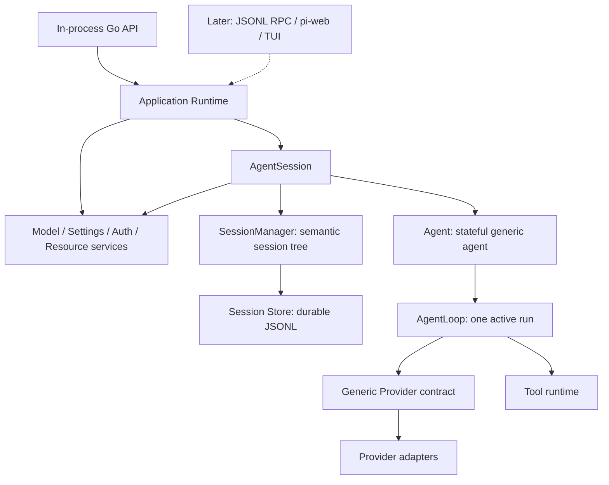

# 核心架构

## 兼容目标

pi-go 重写的是原版 Pi 的 Agent Runtime，而不是只实现一个能够调用模型和工具的相似
程序。兼容性同时包含四个层面：

1. **能力**：原版内部 Agent package 提供的核心能力不得缺失；
2. **分层**：`AgentLoop`、`Agent`、`SessionManager`、`AgentSession` 和 Runtime 的所有权
   与调用方向保持对应；
3. **行为**：消息顺序、队列模式、工具执行、取消、重试、压缩、持久化和事件时序可观察
   结果一致；
4. **数据**：Model、AgentMessage、ToolResult、session entry、event 和 hook payload 能
   表达原版同等信息，并可稳定转换。

“Go 化”允许改变枚举表达、接口拆分、错误包装、锁、goroutine、不可变值和资源释放方式，
但不允许删除字段、缩减状态、合并原本独立的职责，或让厂商 wire type 渗入通用核心。
目标是语义和结构一一对应，不要求逐行翻译 TypeScript。

## 目标调用链

外部传输只驱动 Runtime。RPC 不拥有另一套 session state，pi-web 状态也不进入 Agent
核心。首期验收点是最上方的 in-process Go API；虚线部分全部后置。

## 层次职责

### AgentLoop

`AgentLoop` 是单次 active run 的纯控制流内核。它应按照原版契约：

- 接收当前 Agent context 和本次输入消息；
- 逐轮调用 Provider，转发完整、顺序稳定的 lifecycle/message/tool event；
- 执行 tool call，保留富 ToolResult，再决定是否发起下一轮推理；
- 支持 `prepareNextTurn` 的完整上下文、steering 消息注入和
  `shouldStopAfterTurn` 判定；
- 正确处理部分 stream、provider/tool failure、abort、结束原因和 usage；
- 在一次 run 结束前完成必要 settlement，不遗留可继续提交状态的 goroutine。

它不拥有 durable session、产品设置、重试或压缩策略，也不长期拥有 steering/follow-up
queue。这些状态由上层提供；Loop 只执行本次 run 的协议。

### Agent

`Agent` 是通用的 stateful agent wrapper，不能省略后把所有状态直接塞进
`AgentSession`。它对应原版 Agent 的公共语义：

- 持有 AgentState：system prompt、model、thinking level、tools、messages、streaming
  状态、当前 error 等；
- 管理唯一 active run、订阅者、abort、wait/settlement 和连续 prompt；
- 管理 steering 与 follow-up 队列及其 delivery mode；
- 在每个 provider turn 前从当前 state 生成不可变 snapshot；
- 调用 AgentLoop，并将 event 归并回 state。

Agent 是可复用的通用层；它不知道 session 文件、项目资源、模型目录或 pi-web。

### SessionManager 与 Session Store

`SessionManager` 负责原版 v3 session 的**行为语义**，包括 append-only entry、当前 leaf、
tree/branch、上下文构建、fork、compaction/branch summary、model/thinking 变化、name、label、
custom entry/custom message 和 session listing metadata。其 entry union、序列化字段和恢复
结果以原版类型与 fixtures 为准。

`Session Store` 是它下面的 Go 持久化实现，负责文件锁、原子追加、恢复、损坏处理和未知
数据保护。可靠存储不能替代 SessionManager；仅能读写 JSONL 也不等于具备原版 session
能力。Provider 的临时请求对象不得成为 durable session schema。

### AgentSession

`AgentSession` 是 coding-agent 产品核心，组合 Agent、SessionManager 和应用服务。它负责：

- 绑定当前 SessionManager，把 Agent message 持久化为正确的 session entry 并恢复 Agent state；
- model、thinking level、system prompt、tool set 与运行中 reload；
- retry、context overflow、automatic/manual compaction 和恢复策略；
- prompt、continue、steer、follow-up、abort、bash 与工具控制；
- 当前 session 的 tree navigation、name、stats 等产品操作；
- settings/model/auth/resource 的重载与变化传播；
- 将通用 Agent event 转换成稳定、传输无关的产品 event；
- 保留 extension-neutral hook 与 custom data 接口，即使 loader 本身尚未实现。

AgentSession 不复制 AgentLoop，也不直接编码某个 Provider 或某个前端的行为。

### Application Runtime

Runtime 是长期运行的进程内装配层。它创建服务和 AgentSession，负责 new/switch/fork/
import 等 session replacement 生命周期，并向调用者暴露一套可测试的 Go API。它不依赖
stdin/stdout framing，因而之后可以由 JSONL RPC、其他服务或 CLI 共同驱动。

首期必须完成 Runtime 的内部装配和生命周期；JSONL 编解码、进程协议和 pi-web adapter
不在首期实现范围内。

## 核心数据契约

### Model 与 Provider

`Model` 的字段集与语义以原版 `packages/ai` 为准，至少完整覆盖 provider、API dialect、
模型标识、base URL、headers、reasoning、thinking level map、input 类型、cost tiers、context
window、max tokens 和 API-specific compat。它不是只用于路由的几个字符串；request 级信息
则属于完整 stream options。

Provider contract 接收通用 Model、LLM context 和完整 stream options，返回通用事件流。
adapter 独占厂商请求转换、认证、错误归类、usage 映射和 replay metadata。response ID、
encrypted reasoning、cache key 等信息只有在带明确 provenance 时才能穿过通用层；增加非
OpenAI Provider 不应改动 AgentLoop。

首期不要求补齐所有 Provider。现有 OpenAI Responses 与 Chat Completions adapter 可以
作为 production proof，同时必须有不使用 OpenAI 数据形状的 fake/contract test，证明核心
抽象确实通用。

### AgentMessage 与 ToolResult

Agent 层使用原版可扩展的 `AgentMessage` 语义，而不是把所有输入提前压成 LLM 文本。
`convertToLlm` 是明确边界：custom/bash/compaction/branch 等 Agent 或 session 消息在这里
转换、过滤或展开为 Provider 可见的 LLM message。

端到端链路必须保留：

- user 的 text/image 内容；
- assistant 的 text/thinking/tool call 与厂商 replay metadata；
- tool execution result 的 provider-visible text/image、runtime-visible details、usage、
  dynamically added tool names 和 terminate；最终 ToolResultMessage 还保留 tool identity、
  `isError` 与 timestamp；
- 队列、context transform、compaction、session persistence 和 event 中的同等信息。

### Event 与 hook

事件名称、先后顺序、payload、usage/cost 和 error/stop 原因属于核心兼容面。内部先使用
传输无关的 typed value；JSONL 只是后续编码方式。Observer、tool、Provider 或 extension
hook 均不得在持有 Agent/SessionManager 内部锁时调用。

extension loader 可以后置，但 `context`、`before_agent_start`、`tool_call`、`tool_result`、
session 事件和 custom data 等与核心调用链相交的契约必须现在保留，不能等接 RPC 时再补洞。

## 核心不变量

- 一个 AgentSession 和一个 active run 都只有一个明确的状态 owner。
- 每个 provider turn 使用不可变 snapshot；turn 之间必须能观察最新动态设置。
- message commit、tool call/result、session entry 和可见 event 的顺序可解释且可测试。
- abort 或结束后，遗留 goroutine 不得再提交 message、entry 或 event。
- provider、tool、observer 与 hook 回调不在内部状态锁内执行。
- usage 与 cost 不能默认为“永远为零”；缺失、未知与真实零值必须可区分。
- 通用层不依赖 vendor wire type，持久化层不静默丢弃未知数据。
- 失败后 state、durable session 和已对外发布事件之间保持一致。

## 重构原则

现有实现只是可复用材料，不是必须维护的架构边界。stream collector、tool scheduler、
session durability、内置工具、auth/resource 等经过验证的代码可以保留；如果 package
所有权、类型或调用链偏离上述目标，应直接移动、拆分或重写。

当前没有对旧内部 Go API、旧文件布局或旧文档叙事的兼容承诺。判断顺序始终是：原版
实际源码与测试、跨实现行为 fixture、pi-go 当前实现，最后才是文档。发现文档不准确时
必须同步修正。
