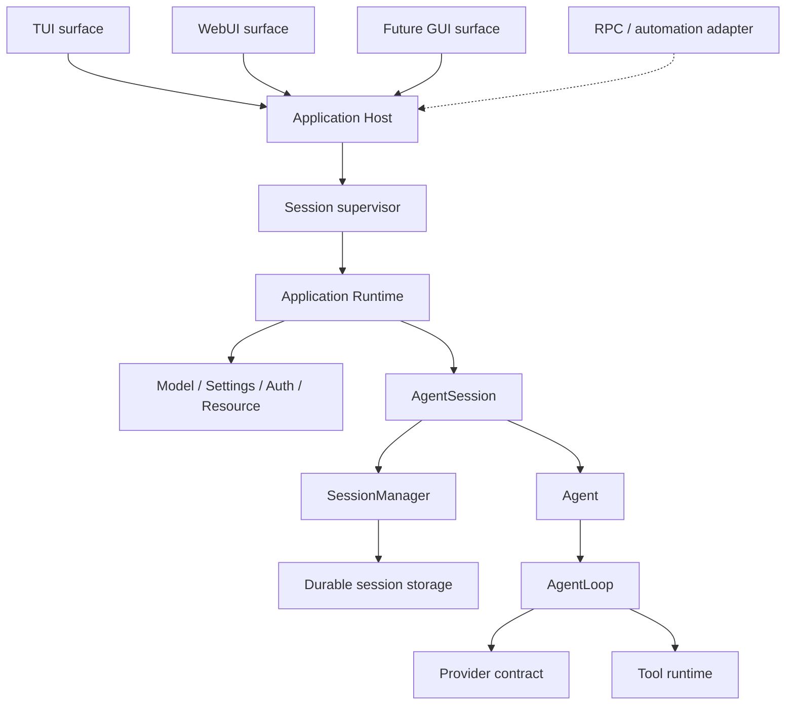

# 核心架构

## 目标

pi-go 重写的是 pi 的完整 Agent Runtime。兼容范围包含：

- 能力：原版 Agent 核心能力不缩水；
- 分层：各层职责、状态所有权和调用方向对应原版；
- 行为：消息、工具、队列、重试、压缩、取消、持久化和事件时序一致；
- 数据：Model、AgentMessage、ToolResult、session entry、event 和 hook payload 不丢信息。

代码形式不要求逐行翻译。Go 特有的锁、goroutine、context、接口和错误包装可以自由设计，
前提是不会改变上述语义。

## 原版基线

当前 coding-agent、CLI、RPC 和 pi-web 实际使用：

`AgentSessionRuntime → AgentSession → Agent → runAgentLoop → SessionManager`

`packages/agent` 中的新 `AgentHarness + SessionRepository/Store` 尚未接管 coding-agent。
它是需要持续跟踪的上游方向，但不能用来跳过现有 AgentSession 的 retry、overflow recovery、
resource/tool 管理和 `agent_settled` 等产品语义。

主要参考入口：

- `../pi/packages/agent/src/agent-loop.ts`
- `../pi/packages/agent/src/agent.ts`
- `../pi/packages/agent/src/types.ts`
- `../pi/packages/coding-agent/src/core/agent-session.ts`
- `../pi/packages/coding-agent/src/core/agent-session-runtime.ts`
- `../pi/packages/coding-agent/src/core/session-manager.ts`
- `../pi/packages/coding-agent/src/core/sdk.ts`

## 目标调用链

Surface 和外部 transport 只驱动 Host/Runtime，不拥有第二套 Agent 状态。HTTP、SSE、进程内
调用或 JSONL 只是接入方式，不能在接入层重新实现 queue、retry、compaction 或 session 行为。
Session supervisor 是多会话生命周期的目标层，不把多个 Runtime 合成一个可变全局状态；每个
活动会话仍由自己的 Runtime/AgentSession 权威拥有。

## 分层职责

### AgentLoop

AgentLoop 负责一次 active run：

- 调用 Provider 并转发 streaming/message/tool lifecycle；
- 执行工具批次并保留完整 ToolResult；
- 处理 multi-turn、steering/follow-up 注入和下一 turn snapshot；
- 处理 provider/tool failure、partial stream、abort 和 settlement。

它不拥有 durable session、产品设置、retry、compaction 或长期队列。

### Agent

Agent 是通用 stateful wrapper，拥有：

- system prompt、model、thinking、tools、messages 和 streaming 状态；
- 唯一 active run、listener、abort 和 wait；
- steering/follow-up 队列及 delivery mode；
- AgentLoop event 到 AgentState 的归并。

Agent 不知道 session 文件、resource 目录、pi-web 或具体 Provider。

### SessionManager

SessionManager 是持久会话树的语义层，负责：

- append-only session entry 和当前 branch/leaf；
- context 构建、tree、branch、fork 和恢复；
- compaction、branch summary、model/thinking change；
- name、label、custom entry/message 和 listing metadata；
- legacy/unknown 数据的明确兼容策略。

底层存储负责锁、追加、原子发布和故障恢复，不能取代 SessionManager 的语义。

### AgentSession

AgentSession 是 coding-agent 产品核心，负责：

- 组合 Agent、SessionManager 和应用服务；
- prompt/continue/steer/follow-up/abort；
- 有序持久化、retry、overflow recovery 和 compaction；
- system prompt、tool registry/active tools、model/thinking 和 reload；
- standalone bash、session navigation、name、stats 和产品事件；
- extension-neutral hooks 与 custom data 通路。

AgentSession 拥有产品策略，但运行中的 model、thinking、system prompt、tools 和 messages
必须以 Agent state 为唯一事实源。

### Application Runtime 与 Host

Runtime 负责创建 cwd-bound 服务和 AgentSession，以及 new/switch/fork/import/dispose 等
replacement 生命周期。

Host 在 Runtime 之上提供 transport-neutral 边界：

- command dispatch 和结果；
- 权威 state snapshot；
- 单一有序 event stream；
- session/runtime identity 与生命周期；
- active operation、flush 和 shutdown 顺序。

Transport adapter 只进行 framing、字段兼容和连接管理。

### Surface 与 Session Supervisor

TUI、WebUI 和未来 GUI 是 Application Host 的独立 surface adapter：

- 共用强类型 command、query、event 和 capability contract；
- 只保留滚动、面板、窗口、选中标签等瞬时呈现状态；
- 不读取 session 文件推导实时 Agent 状态；
- 可以按各自媒介投影、合并或编码事件，但不能改变 durable 或 canonical 事件语义；
- 不要求共用按钮、对话框、主题或其他最低公分母 UI 抽象。

多会话 surface 通过 Session supervisor 持有 Host/Runtime 句柄并统一收束生命周期。TUI 可以只
暴露单会话体验，WebUI/GUI 可以多标签，但底层 Agent 行为和状态所有权不分叉。

各 surface 采用独立 composition root 和构建目标。默认核心构建不导入 Web/GUI 包；可选资源
只进入对应二进制。JSONL RPC 保留为外部自动化和兼容验收 transport，不作为进程内产品 surface
之间的桥。

## 核心不变量

- AgentSession、Agent 和每次 active run 都有唯一状态 owner。
- 每个 provider turn 使用不可变 snapshot，turn 之间能看到最新配置。
- assistant tool call 在工具执行前已经进入 Agent state 和持久化顺序。
- 并行工具可以按完成顺序发事件，但 ToolResult message 按原调用顺序进入上下文。
- `agent_end` 只表示一次底层 run 结束；高层操作完成以 `agent_settled` 为准。
- `agent_settled` 对外可见时 session 已经 idle。
- active tools、tool registry、system prompt 和 resources 由同一条重建路径保持一致。
- abort 或 shutdown 后，遗留 goroutine 不得继续提交 message、entry 或 event。
- 通用层不依赖 vendor wire type，durable schema 不静默丢弃未知数据。
- fake 只用于测试，不能进入普通 production assembly。

## 可后置边界

可以后置：

- TUI、主题和终端交互；
- JS extension/plugin loader 与 extension custom UI；
- HTML export 和其他 surface-specific 功能；
- Provider 数量扩展。

不能后置：

- vendor-neutral Model/Provider/Message/ToolResult 契约；
- AgentSession 产品行为和事件语义；
- extension-neutral hooks、custom data、skills/templates 和 trust；
- transport 所依赖的权威 state、command result 和 event。
