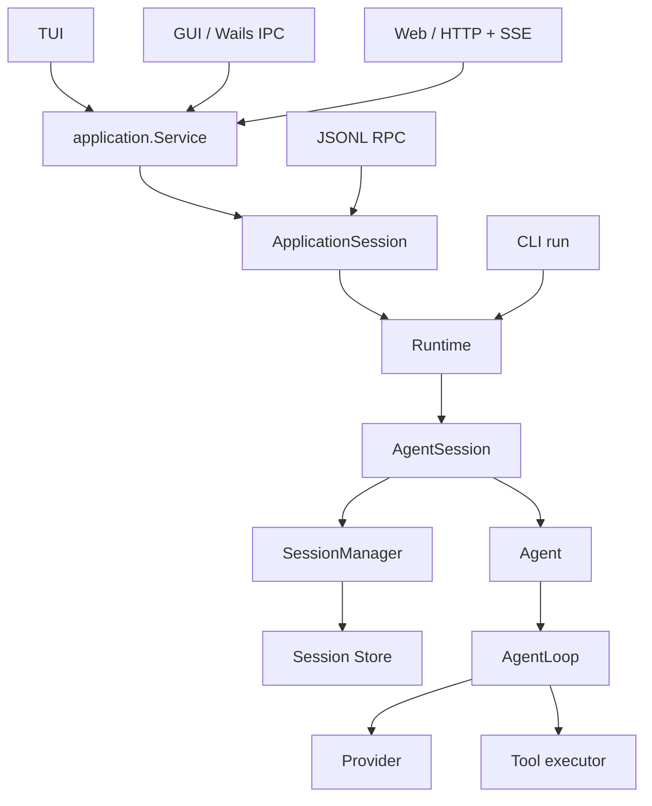

# 核心架构

pi-go 的运行链为 `Runtime → AgentSession → Agent → AgentLoop`。
SessionManager 管理持久会话的语义，Session Store 管理可靠存储；两者与运行循环分工独立。

## 调用关系

`internal/app` 装配模型、认证、设置、资源和工具服务，并创建 Runtime。
`cmd/pi-go` 装配 CLI、TUI、RPC 和 Web；独立模块 `surface/gui` 装配桌面应用。
Android 宿主通过 Web 协议访问远程 Core。

## 状态与职责

| 层次 | 职责与拥有的状态 |
|---|---|
| AgentLoop | 一次运行中的 provider streaming、工具调度、多轮调用与事件顺序 |
| Agent | 长期 AgentState、prompt/continue、steering/follow-up 队列、abort 与监听器 |
| Session Store | 文件锁、追加、原子发布和故障恢复 |
| SessionManager | 会话树、分支、context、fork、恢复、压缩记录与 custom data |
| AgentSession | 组合 Agent 和 SessionManager，负责有序持久化、重试、压缩、动态配置、reload、standalone bash 和产品事件 |
| Runtime | 服务装配、AgentSession 生命周期与 new/switch/fork/import 时的 session replacement |
| ApplicationSession | 单会话 command、snapshot、有序 event stream 和 shutdown |
| application.Service | 多会话发现、打开去重、项目目录、空闲回收和应用级 revision/event stream |
| Surface | 输入、渲染、连接和协议编解码，以及选中标签、滚动、草稿等呈现状态 |

运行中的 model、thinking、system prompt、tools 和 messages 由 AgentState 持有。
AgentSession 发布配置变更，AgentLoop 在每一轮开始时取得不可变快照。Provider 通过统一契约接入，
工具通过 executor 接入，通用运行循环不依赖具体厂商的 wire 类型。

## 持久化与会话发现

JSONL 会话文件是持久对话和会话树的事实源。SessionManager 将 entry 解释为当前分支上下文，
保留 model/thinking change、compaction、branch summary、name、label 和 custom entry/message。

多会话发现使用进程内 catalog，并在本机缓存目录保存可重建的 JSON 快照。查询检查目录及文件的
size/mtime 指纹，只重解析新增或变化的文件。缓存通过临时文件同步和原子替换发布；缺失、损坏
或过期时从 JSONL 恢复。缓存只保存列表投影，不保存第二份会话树。

Application Service 管理每个活动会话的独立 Runtime。移除项目只改变项目列表及资源授权，
不会移除源目录和已有会话文件。

## 事件与并发

- 每个 Agent 同时只有一个 active run；steering 和 follow-up 由 Agent 的队列交付。
- assistant tool call 在工具执行前进入 AgentState 和持久化顺序。
- 并行工具可以按完成顺序发事件，ToolResult message 按调用顺序进入上下文。
- `agent_end` 表示一次底层运行结束；`agent_settled` 表示高层操作收束，此时 session 已 idle。
- active tools、tool registry、system prompt 和 resources 共用重建路径，reload 保留一致的配置代次。
- abort 和 shutdown 收束 provider、工具及持久化工作，再完成生命周期退出。

## 产品目录与安装资料

`internal/product` 定义产品名称、版本和目录规则；`internal/installation` 负责首次数据导入与
随二进制携带的资料安装。`internal/app` 在服务读取配置和资源前完成初始化，然后把 README
和文档目录交给 resource service，供默认提示词生成文档导航。

Bash 的会话环境在 AgentSession 的工具执行边界读取当前状态，每次调用分别传入。
详见[配置与目录](configuration.md)和[本地源码](self-knowledge.md)。

## 实现对应关系

pi 的 Agent、AgentLoop、AgentSession、SessionManager 生产调用链及其行为是移植依据。
固定的上游 revision、复用 fixture 和完整 scenario 见[测试与兼容性验证](testing.md)。
pi-go 使用独立的产品目录、Go 工具链和 Surface；TypeScript extension loader 与 extension
custom UI 不在 Go 运行时内执行，核心保留 typed hooks 和 custom data 契约。
