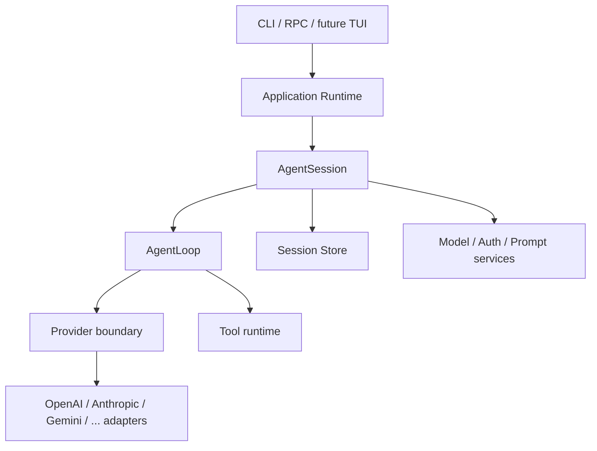

# 核心架构

## 目标

pi-go 要重现原版 Pi 的产品行为，而不是围绕现有 Go package 为缺失能力寻找补丁。
Agent、AgentSession、Model、Provider 和 Message 已经在原版中形成了可工作的语义边界；
默认策略是移植这些边界和行为，只对语言运行时相关的实现方式做 Go 化调整。

如果文档描述、当前 Go 抽象和原版实际调用链冲突，应重新检查原版实现与测试，并更新
Go 代码和本文。不能因为旧迁移计划已经写下某种架构，就继续维持错误边界。

## 目标分层



### AgentLoop

`AgentLoop` 只负责一次运行中的推理和工具控制流：

- 接收已有上下文和新的富消息；
- 调用 provider 并转发规范化 stream event；
- 执行一批 tool call，追加 tool result，再发起下一次推理；
- 处理取消、结束原因和单次运行的错误；
- 在每次 provider 请求前使用调用者提供的最新 turn snapshot。

它不拥有产品设置、长期队列、session 文件、模型选择或压缩策略。

### AgentSession

`AgentSession` 是 coding agent 的产品核心，也是当前 pi-go 最主要的缺口。它长期拥有：

- 当前 model、thinking level、system prompt 和 tool 集合；
- conversation state、steering/follow-up queue 和 active run；
- retry、context window、compaction 和恢复策略；
- session 持久化、分支选择以及有序事件；
- 运行期间的 model/settings/resource reload。

每次 provider 推理前，AgentSession 都必须重新准备 turn snapshot。这样在 tool chain
期间发生的模型切换、thinking 调整、prompt reload 或 tool 变更才能影响下一轮，而不必
销毁整个 session。

### Model 与 Provider

Model 应移植原版的通用模型语义，包括 provider、API dialect、模型标识、能力、context
window、max tokens、reasoning、cost 和必要 request metadata。它不是只有三个字符串的
route key。

Provider boundary 接收通用 Model、上下文和调用选项，并返回通用 stream。各 adapter
负责厂商请求转换、认证、错误映射和后续轮次需要的 provider metadata：

```text
AgentLoop -> generic provider request -> provider adapter -> vendor API
```

OpenAI Responses 的 response ID、encrypted reasoning 或 item replay 不能成为通用消息
接口本身。必须保留的厂商数据应由对应 adapter 识别，并带有明确 provenance；增加新
Provider 不应要求修改 AgentLoop 的控制流。

这里不需要重新发明一套抽象。以原版 `packages/ai` 的实际类型、调用点和测试为基准，
把语义直接移植到 Go；只有明确的 Go 类型安全、并发或资源生命周期问题才需要改变实现。

### 富消息与 Tool Result

核心消息链路从一开始就必须支持：

- user：text、image；
- assistant：text、thinking、tool call；
- tool result：text、image，以及不发送给模型但供 UI/runtime 使用的结构化 details。

Agent 输入、队列、上下文构建、provider adapter、tool executor、session persistence、
event 和 RPC 必须使用同一组富内容语义。不能在中间层把内容提前压成字符串。

### Session Store

Session Store 负责可靠保存，不负责决定 Agent 的运行策略。它应继续保留现有的原子
追加、锁、tree/branch、恢复和 unknown data 安全能力。

完整的旧会话兼容可以晚于 Agent 核心重构，但当前数据模型必须能表达 model change、
thinking level change、compaction 和 branch summary，避免以后再次更换格式。Provider
adapter 的临时请求对象不能直接成为 durable state。

### Runtime 与 pi-web

CLI、长期运行进程和未来 TUI 都使用同一个 AgentSession。对 pi-web 的首选接入方式是
实现原版已有的 JSONL RPC 命令与事件语义，让 pi-web 主要修改进程启动和 transport
adapter，而不是让 pi-go 核心理解页面状态。

RPC 是 AgentSession 的外部控制面，不是 Agent 核心的数据模型。

## 核心不变量

- 一个 active session 只有一个明确的状态 owner。
- provider、tool 和 observer 回调不在 session 锁内执行。
- 取消或结束后，遗留 goroutine 不得继续提交消息或事件。
- tool call、tool result、message commit 和可见 event 的顺序可解释且可测试。
- 每个 provider turn 使用不可变 snapshot，但 snapshot 在 turn 之间可以变化。
- 通用层不依赖某个 vendor wire type。
- 持久化读取遇到未知数据时不静默破坏原文件。

## 对现有代码的处理

现有 stream collector、tool scheduler、取消与 settlement、session storage/tree、内置工具、
auth 和 resource 实现都可以继续使用。核心重构的重点不是推倒重来，而是：

1. 将 `internal/agent` 中纯单次运行的部分收敛为 AgentLoop；
2. 把动态产品状态和策略放入新的 AgentSession；
3. 用原版语义重整 model/provider/message 边界；
4. 再把已有高级能力接入实际 Runtime。
