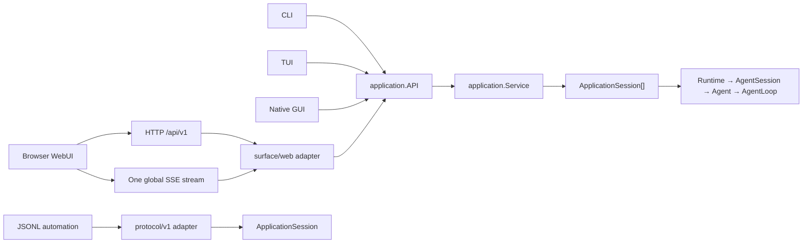

# Surface 架构

## 一个核心，三种接入方式

pi-go 只有一套 Agent/Application Core。GUI、TUI、WebUI、CLI 和自动化协议不复制
Runtime、AgentSession、Agent 或 SessionManager 的状态与策略。



| 调用方 | 默认通信方式 | 原因 |
|---|---|---|
| CLI | 同进程 Go 调用 | 无需序列化，也不引入服务生命周期 |
| TUI | 同进程 Go 调用 | 终端只是呈现层，直接消费 typed API 和事件 |
| 原生 GUI | 同进程 Go 调用；多进程壳才使用本地 IPC | GUI 不应被迫依赖 HTTP |
| 浏览器 WebUI | HTTP command/query/snapshot + 一条全局 SSE | 浏览器天然需要网络边界 |
| 外部自动化/测试 | stdin/stdout JSONL | 适合脚本、跨语言和协议验收 |

因此不存在产品内部的 `pi attach http://...` 模式。以后若要支持远程客户端，那是显式的
remote/server 部署能力，不是 TUI、GUI 与 Agent Core 的默认耦合方式。

## 统一 Application API

`internal/application.API` 是所有产品 surface 的进程内边界，提供：

- typed command 与 command result；
- 权威 live state 和 durable session snapshot；
- session discovery、打开去重、identity replacement 与生命周期；
- 应用级单调 revision、有限事件回放和 cursor subscription。

`application.Service` 管理多个彼此独立的 `ApplicationSession`。每个会话仍由自己的
`Runtime → AgentSession → Agent` 权威拥有；Service 不把多个会话合并成一份可变 Agent 状态。

状态所有权保持如下：

- durable conversation/tree 只在 SessionManager/store；
- active model/tools/messages/queue/run 只在 Agent/AgentSession；
- ApplicationSession 只负责单会话命令、snapshot 和有序事件；
- Service 只负责多会话发现、生命周期和应用级事件总序；
- surface 只保留选中标签、面板尺寸、滚动位置、输入草稿等呈现状态。

## Web 适配器

`surface/web` 依赖 `application.API`，不依赖具体 Service 实现。公开边界统一放在 `/api/v1`：

- `POST /api/v1/sessions`：创建会话；
- `GET /api/v1/snapshot`：应用会话与运行状态快照；
- `GET /api/v1/sessions/{id}`：单会话 durable + live 快照；
- `POST /api/v1/sessions/{id}/commands`：命令；
- `GET /api/v1/events`：所有会话共用的一条 SSE。

SSE 使用 `id: <revision>` 和 `Last-Event-ID`。Service 保留有限历史；游标过期时服务器发送
`reset_required`，客户端重新读取 snapshot，再继续消费 live events。慢客户端只会断开自己的
订阅，不会向 Agent 执行施加网络背压。

前端的 application client 在整个页面中只维护一条 EventSource，并按 `sessionId` 分发给聊天、
侧栏等消费者。React hook 不再各自创建服务器连接，也不通过轮询维护第二套运行状态。

## 构建与入口

所有运行形态由一个二进制提供：

```sh
pi-go run [agent options]
pi-go web [--listen ...]
pi-go rpc [rpc options]
```

`cmd/pi-go` 是唯一 composition root。`pi_go_webui` build tag 只决定是否把静态 Web export 嵌入
同一个二进制，不切分 Application/Agent 逻辑。开发态由 Next 提供 HMR，并将 `/api/v1/*`
代理到 `pi-go web --api-only`；生产态只需 Go 二进制，不启动 Next 或 JSONL 子进程。

TUI 与 GUI 实现应直接接收 `application.API`。若原生 GUI 采用多进程壳，
只在壳与 Go backend 之间增加本地 IPC adapter，command/query/event 语义仍与进程内 API 相同。
