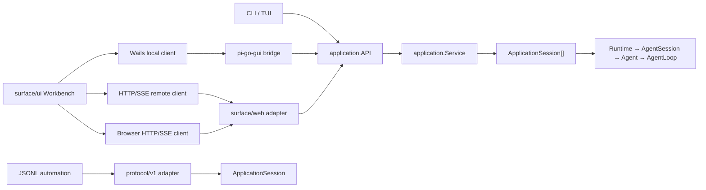

# Surface 架构

## 一个核心，两个产品入口

pi-go 只有一套 Agent/Application Core。GUI、TUI、WebUI、CLI 和自动化协议不复制
Runtime、AgentSession、Agent 或 SessionManager 的状态与策略。桌面 GUI 是完整产品，
不是远程页面的套壳；它由独立的 composition root 构建，但在进程内装配同一套 Go 核心。



| 调用方 | 默认通信方式 | 原因 |
|---|---|---|
| CLI | 同进程 Go 调用 | 无需序列化，也不引入服务生命周期 |
| TUI | 同进程 Go 调用 | 终端只是呈现层，直接消费 typed API 和事件 |
| 桌面 GUI | Wails IPC → 同进程 Go Core | 独立产物内嵌完整 Agent 能力，不依赖 HTTP 才能本地工作 |
| 桌面 GUI（远程模式） | HTTP command/query/snapshot + 全局 SSE | 与 WebUI 共用远程协议，不启动第二套 Agent |
| 浏览器 WebUI | HTTP command/query/snapshot + 一条全局 SSE | 浏览器天然需要网络边界 |
| Android 移动端 | 同一 Workbench + Wails 移动宿主 + HTTP/SSE | 独立构建，只展示和控制远程 Core |
| 外部自动化/测试 | stdin/stdout JSONL | 适合脚本、跨语言和协议验收 |

本地和远程是 Workbench 的两种 `ApplicationClient`，不是两套页面。桌面端可以在设置中
从内嵌 Core 切到另一台 pi-go 的 HTTP/SSE endpoint；WebUI 和移动端只提供远程 client。
平台差异保留在宿主、窗口、导航和输入适配层，不追求零代码覆盖所有平台。

## 统一 Application API

`internal/application.API` 是所有产品 surface 的进程内边界，提供：

- typed command 与 command result；
- 权威 live state 和 durable session snapshot；
- session discovery、打开去重、identity replacement 与生命周期；
- 可持久化的项目目录、显式添加/移除和项目变更事件；
- 应用级单调 revision、有限事件回放和 cursor subscription。

`application.Service` 管理多个彼此独立的 `ApplicationSession`。每个会话仍由自己的
`Runtime → AgentSession → Agent` 权威拥有；Service 不把多个会话合并成一份可变 Agent 状态。

状态所有权保持如下：

- durable conversation/tree 只在 SessionManager/store；
- active model/tools/messages/queue/run 只在 Agent/AgentSession；
- ApplicationSession 只负责单会话命令、snapshot 和有序事件；
- Service 只负责多会话发现、项目目录、生命周期和应用级事件总序；
- surface 只保留选中标签、面板尺寸、滚动位置、输入草稿等呈现状态。

从项目目录移除项目只影响列表可见性和资源授权，不删除源目录或已有会话；再次添加同一路径
即可恢复。项目目录因此可以独立保存尚未产生会话的空项目，而不需要 surface 伪造 session。

## Web 适配器

`surface/web` 依赖 `application.API`，不依赖具体 Service 实现。公开边界统一放在 `/api/v1`：

- `POST /api/v1/sessions`：创建会话；
- `GET /api/v1/snapshot`：应用会话与运行状态快照；
- `GET /api/v1/sessions/{id}`：单会话 durable + live 快照；
- `POST /api/v1/sessions/{id}/commands`：命令；
- `POST /api/v1/projects`：添加已有项目目录；
- `DELETE /api/v1/projects`：从项目列表移除目录；
- `GET /api/v1/events`：所有会话共用的一条 SSE。

SSE 使用 `id: <revision>` 和 `Last-Event-ID`。Service 保留有限历史；游标过期时服务器发送
`reset_required`，客户端重新读取 snapshot，再继续消费 live events。慢客户端只会断开自己的
订阅，不会向 Agent 执行施加网络背压。

前端的 application client 在整个页面中只维护一条 EventSource，并按 `sessionId` 分发给聊天、
侧栏等消费者。React hook 不再各自创建服务器连接，也不通过轮询维护第二套运行状态。

非 loopback 监听必须配置 `--password` 或 `PI_GO_WEB_PASSWORD`。开发阶段不强制 VPN
或 TLS；认证只提供基础访问边界。loopback 开发仍可无密码运行，避免本机调试产生额外步骤。

## 共享 Workbench 与迁移原则

`surface/ui` 是可读的 React/TypeScript 源码包，包含统一的工作区布局、展示状态和两种
`ApplicationClient`。它不持有 Agent 策略。GUI、WebUI 和移动宿主都只保留各自的宿主与
transport 适配，共用同一个 Workbench；WebUI 使用当前页面 origin 上的 HTTP/SSE client。
文件树的引用操作和单文件右侧预览也属于这层共享状态；文本、Markdown、图片、音频、PDF
与 DOCX 使用同一份文件类型判断，只由本地 IPC 或远程 HTTP 适配读取内容。
项目标题栏的添加入口、项目行的移除菜单以及新对话输入框中的项目选择器同样只实现一次；
项目选择器只在尚未绑定 durable session 的全新对话中出现，历史会话沿用其既有工作目录。

旧 WebUI 组件源码暂时作为迁移材料保留，但不再由页面入口挂载。后续能力继续进入共享
Workbench，不在 Web surface 重建第二套交互状态或独立样式。

视觉实现只复用有清晰许可证、可维护的源代码。OpenCodex 的已编译 renderer、提取产物和
混淆 bundle 不进入仓库；已复用的源文件和许可证在各 surface 的 notice 中记录。

## 构建与入口

默认产品由 `cmd/pi-go` 构建，完全不链接 Wails、GUI 前端或 GUI 静态资源：

```sh
pi-go run [agent options]
pi-go web [--listen ...]
pi-go rpc [rpc options]
```

`pi_go_webui` build tag 只决定是否把静态 Web export 嵌入
同一个二进制，不切分 Application/Agent 逻辑。开发态由 Next 提供 HMR，并将 `/api/v1/*`
代理到 `pi-go web --api-only`；生产态只需 Go 二进制，不启动 Next 或 JSONL 子进程。

`surface/gui` 是独立 Go module 和第二个 composition root，通过统一 Surface 构建入口生成：

```sh
make setup SURFACE=gui
make check SURFACE=gui
make build SURFACE=gui
```

输出为 `bin/pi-go-gui`。这个二进制链接完整 Core、Wails bridge 和 Workbench静态资源。
`SURFACE=terminal` 的构建和检查不遍历
GUI module，也不会因为 GUI 引入 CGO、Node 或平台 SDK。

`surface/mobile` 是另一个独立 Go module。当前只构建 Android arm64，最低 API 26；其 Go
宿主只实现 HTTP/HTTPS 请求和可重连 SSE，不依赖根 module，也不链接 Agent Core。移动端构建
同样只通过显式命令进入：

```sh
make setup SURFACE=mobile
make doctor SURFACE=mobile
make check SURFACE=mobile
make build SURFACE=mobile
make dev SURFACE=mobile
```

APK 会从 Android/Gradle 的原始构建目录复制到
`surface/mobile/bin/pi-go-mobile.apk`；后续安装与运行也统一读取这个 Surface 产物目录。

Android 开发默认面向开启 USB 调试的真机，不要求安装模拟器或系统镜像。iOS 保留为未来同一
移动产品的第二个平台，本阶段不生成或维护 iOS 工程。
